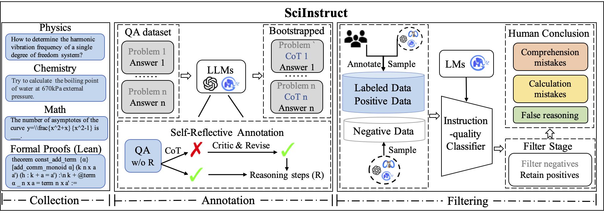
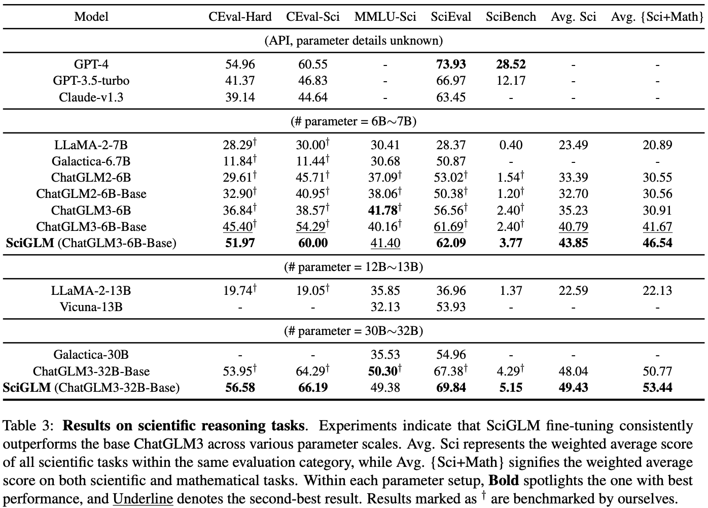
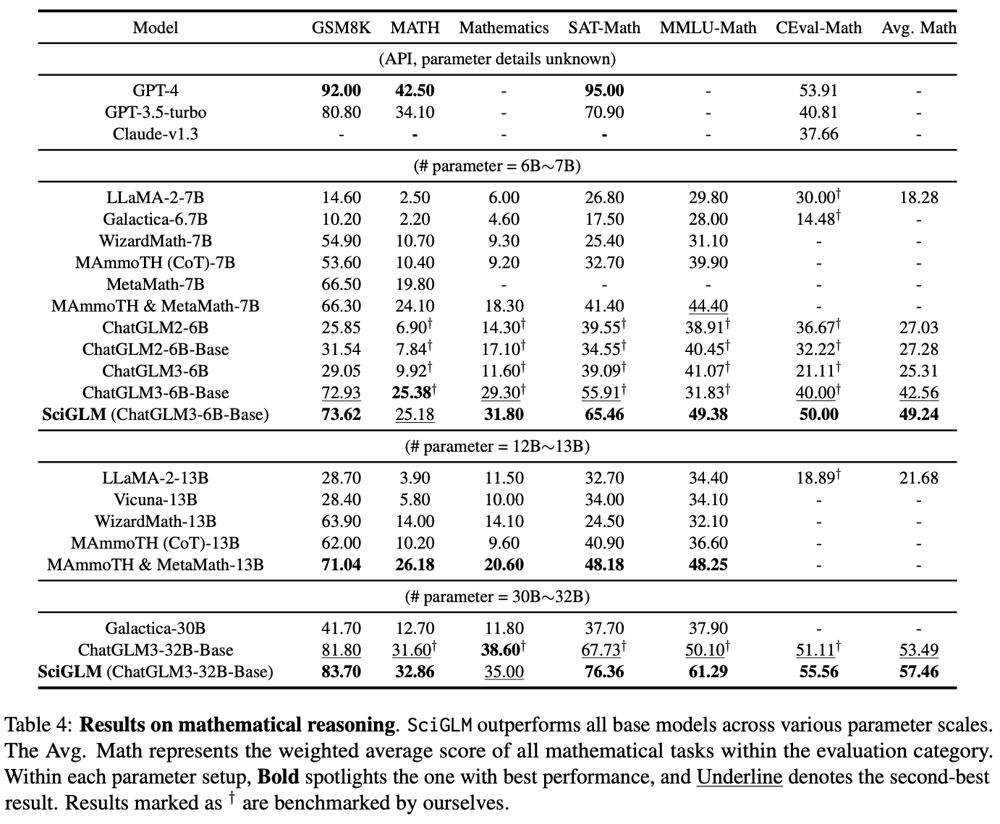

# SciGLM: Training Scientific Language Models with Self-Reflective Instruction Annotation and Tuning

<p align="center">
📃 <a href="https://arxiv.org/abs/2401.07950" target="_blank">[SciGLM]</a> <a href="https://github.com/THUDM/SciGLM" target="_blank">[GitHub]</a> <br>
</p>

**SciGLM** is a suite of scientific language models able to conduct college-level scientific reasoning. Central to our approach is a novel self-reflective instruction annotation framework to address the data scarcity challenge in the science domain. This framework leverages existing LLMs to generate step-by-step reasoning for unlabelled scientific questions, followed by a process of self-reflective critic-and-revise. Applying this framework, we curated SciInstruct, a diverse and high-quality dataset encompassing mathematics, physics, chemistry, and formal proofs.




## **Table of Contents**

- [SciInstruct](#introduction)
- [Training](#Training)
- [Leaderboard](#Leaderboard)
- [Citation](#Citation)

## **SciInstruct**

We construct the SciInstruct as follows:

| Subject  |  Math  | Physics\&Chemistry | Formal Proofs (Lean) | Total   |
| -------- | :----: | :----------------: | :------------------: | ------- |
| # Number | 89,934 |       42,034       |        40,248        | 172,216 |

We will release our data and model for public use.

## **Training**

### **Fine-tuning**

To train the 6B model, run:

```bash
LR=3e-6
WR=0.0
LST=linear
epoch=2
MASTER_PORT=$(shuf -n 1 -i 10000-65535)

deepspeed --include="localhost:0,1,2,3" --master_port $MASTER_PORT main.py \
    --deepspeed /path/to/deepspeed.json \
    --do_train \
    --train_file /path/to/SciInstruct.json \
    --eval_steps 200 \
    --prompt_column content \
    --response_column summary \
    --overwrite_cache \
    --model_name_or_path /path/to/ChatGLM3-6b-Base \
    --output_dir ./output/SciGLM-LR$LR-WR$WR-$LST-epoch$epoch \
    --overwrite_output_dir \
    --max_source_length 128 \
    --max_target_length 512 \
    --per_device_train_batch_size 4 \
    --per_device_eval_batch_size 4 \
    --gradient_accumulation_steps 2 \
    --predict_with_generate \
    --num_train_epochs $epoch \
    --logging_steps 20 \
    --save_strategy epoch \
    --learning_rate $LR \
    --lr_scheduler_type $LST \
    --warmup_ratio $WR \
    --fp16
```

## **Leaderboard**

Results on Scientific Reasonings tasks



Results on Mathematical Reasoning



## **Citation**

If you find our work helpful, please kindly cite our paper:

```
@misc{zhang2024sciglm,
      title={SciGLM: Training Scientific Language Models with Self-Reflective Instruction Annotation and Tuning}, 
      author={Dan Zhang and Ziniu Hu and Sining Zhoubian and Zhengxiao Du and Kaiyu Yang and Zihan Wang and Yisong Yue and Yuxiao Dong and Jie Tang},
      year={2024},
      eprint={2401.07950},
      archivePrefix={arXiv},
      primaryClass={cs.CL}
}
```
